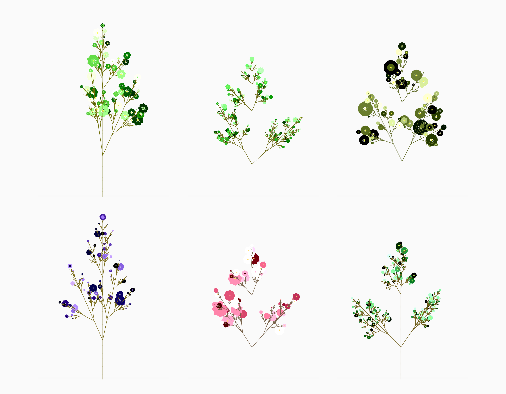
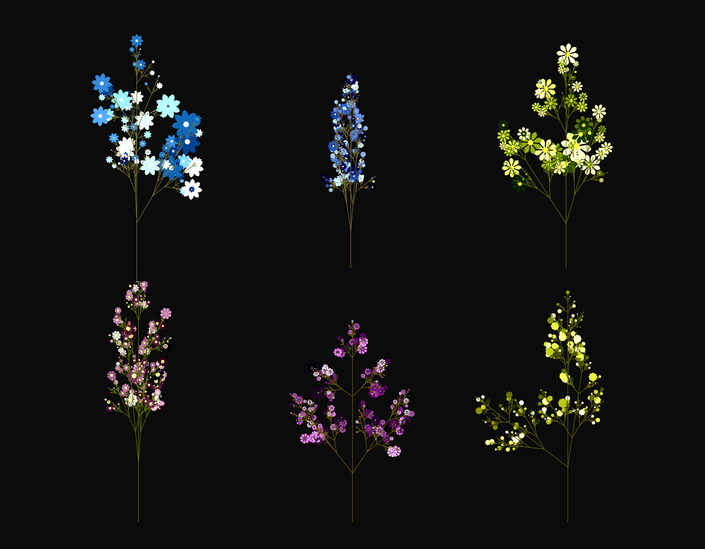

# Botanicals 

Generating flower-like structures with Lindenmayer Systems fractals.

<a href="https://anokhee.github.io/botanicals/">View Demo</a>

### Resources
<ul>
  <li><a href="http://progsystem.free.fr/plantsimulation.htm">SIMULATION OF PLANTS</a> </li>
  <li><a href="http://algorithmicbotany.org/papers/abop/abop.pdf">The Algorithmic Beauty of Plants</a></li>
  </ul>

### Output
  

