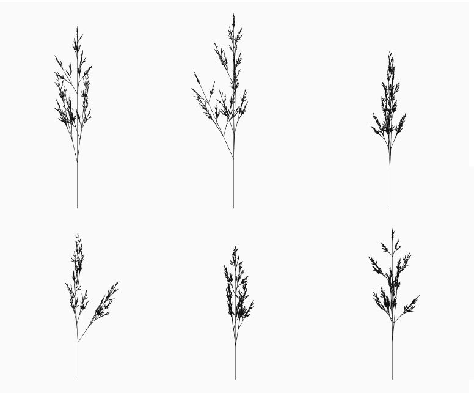
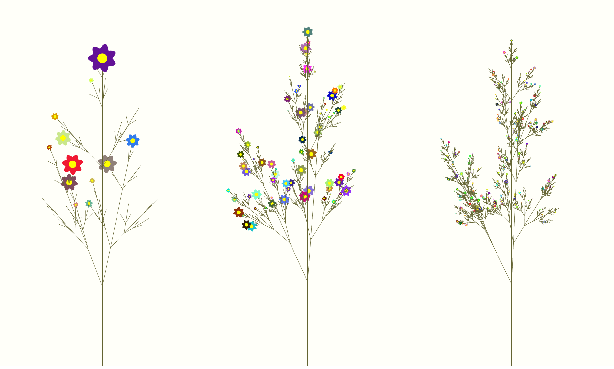
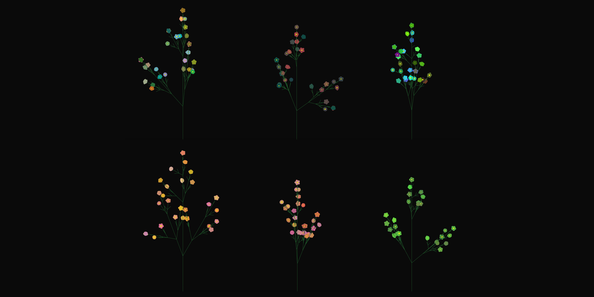

# Botanicals 

Generating plants with Lindenmayer Systems -- WIP. 

### Resources
<ul>
  <li><a href="http://progsystem.free.fr/plantsimulation.htm">SIMULATION OF PLANTS</a> </li>
  <li><a href="http://algorithmicbotany.org/papers/abop/abop.pdf">The Algorithmic Beauty of Plants</a></li>
  </ul>

### Output
  
Phase 1 - Basic Fractal Stems(4/12/2020)

  
Phase 2 - L-Systems With Some Randomness (4/15/2020)

  
Phase 3 - Rudimentary Flowers (4/17/2020)

  
Phase 3 - Rudimentary Flowers (4/17/2020)

